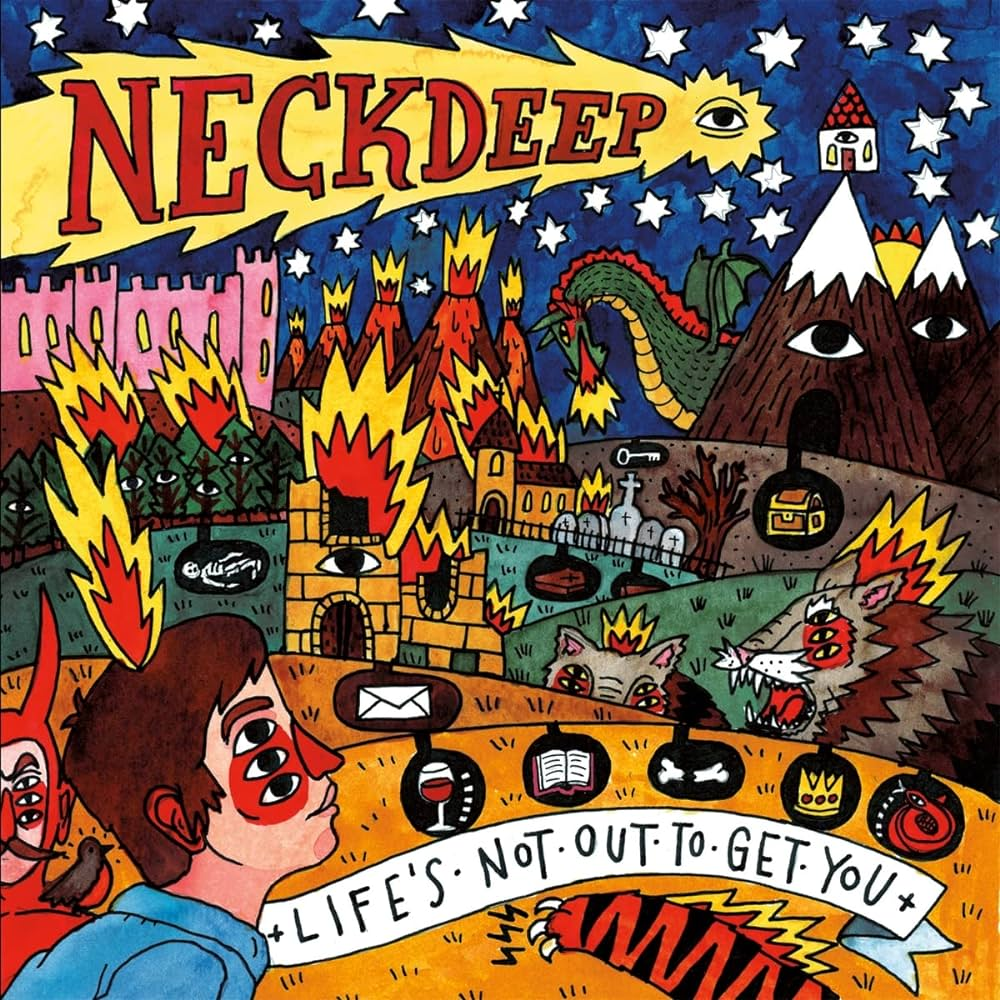
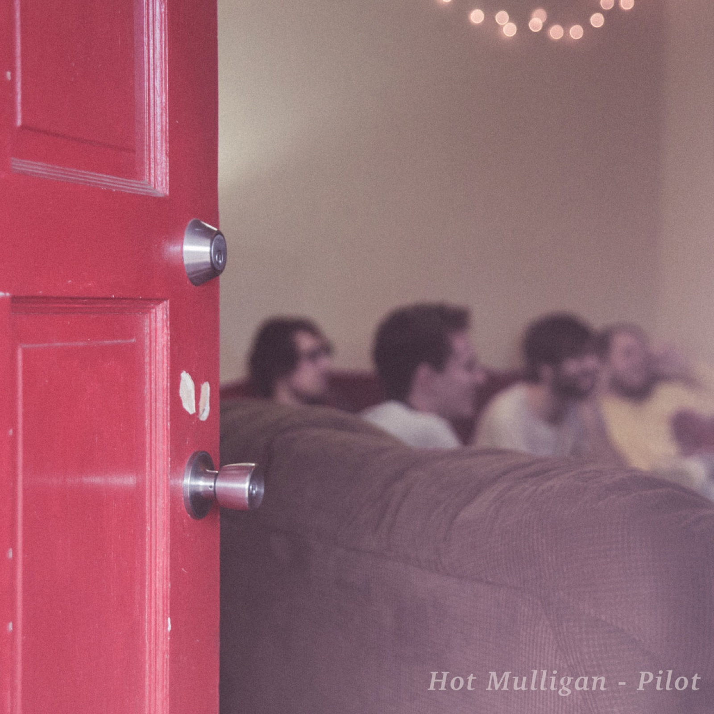
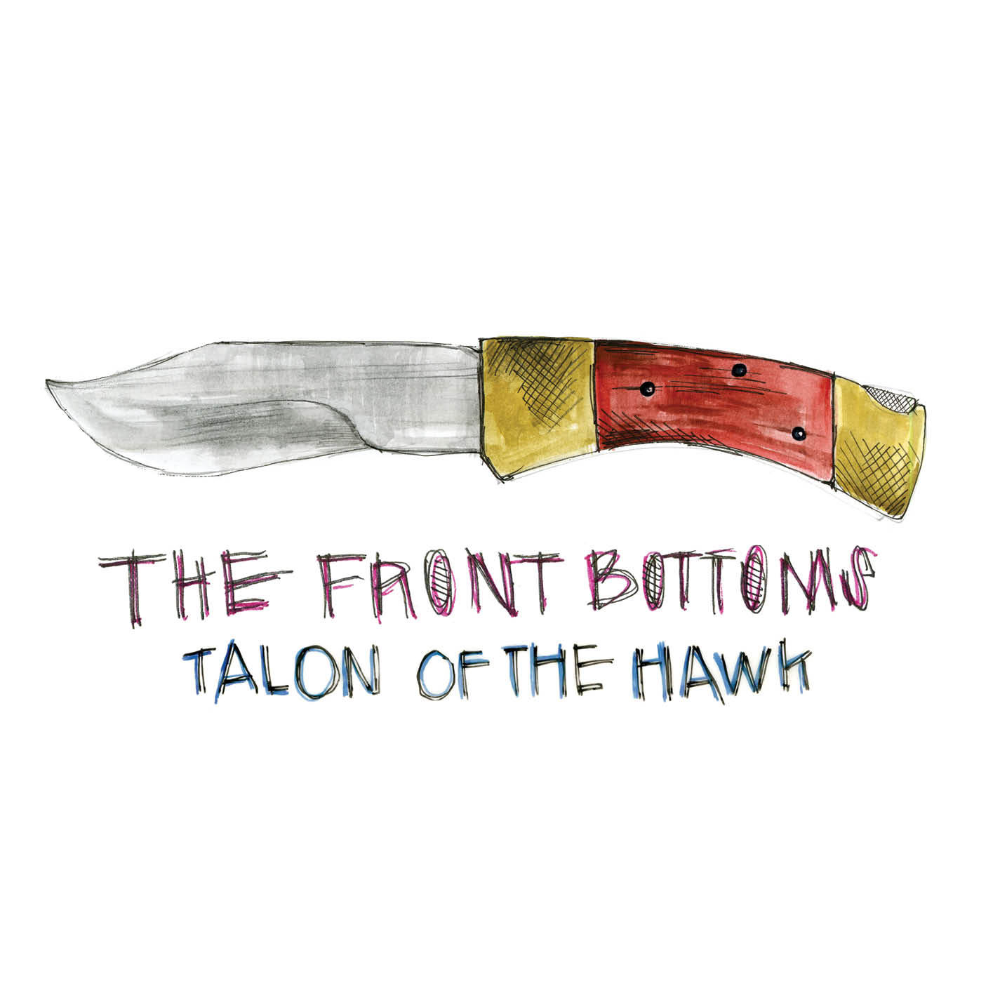

# pixelfox114 - 😺

  
  
  
  
  

  Text here is a test v2.

  This text is a test lol ( do you feel this isnt complete?).
  yeh, ofc it isnt dummy

<!--
**pixelfox114/pixelfox114** is a ✨ _special_ ✨ repository because its `README.md` (this file) appears on your GitHub profile.
Here are some ideas to get you started:
- 🔭 I’m currently working on ...
- 🌱 I’m currently learning ...
- 👯 I’m looking to collaborate on ...
- 🤔 I’m looking for help with ...
- 💬 Ask me about ...
- 📫 How to reach me: ...
- 😄 Pronouns: ...
- ⚡ Fun fact: ...
-->
